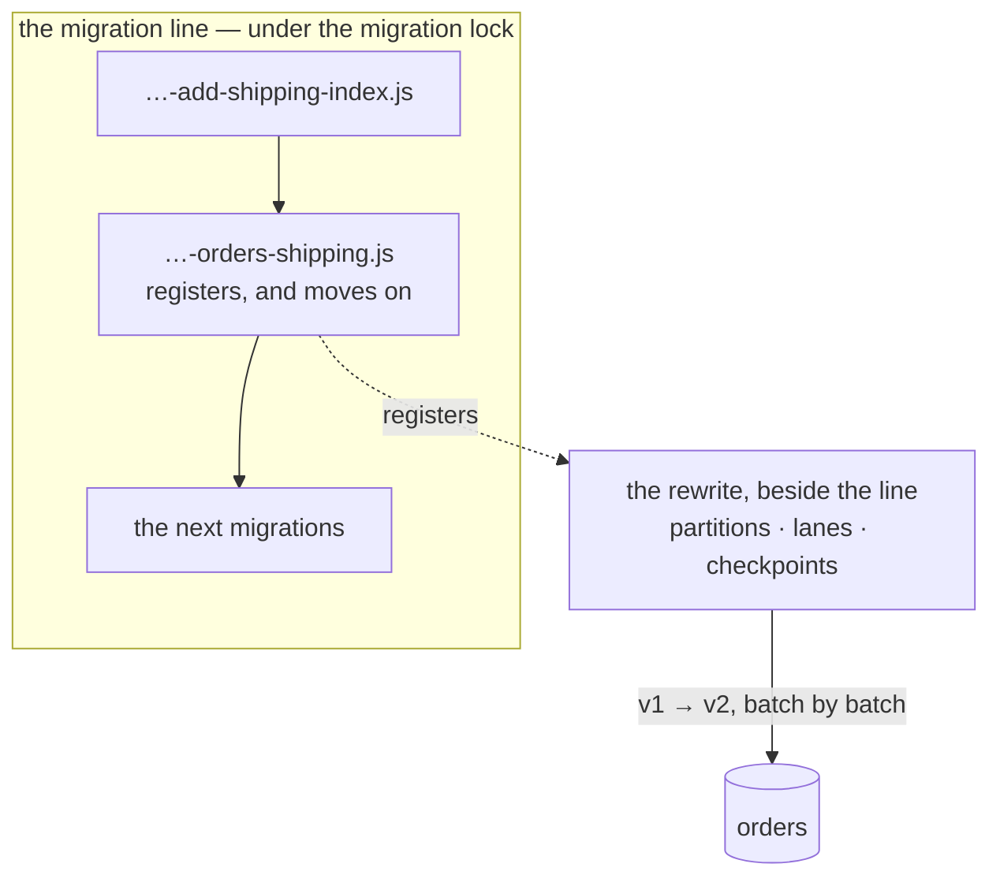
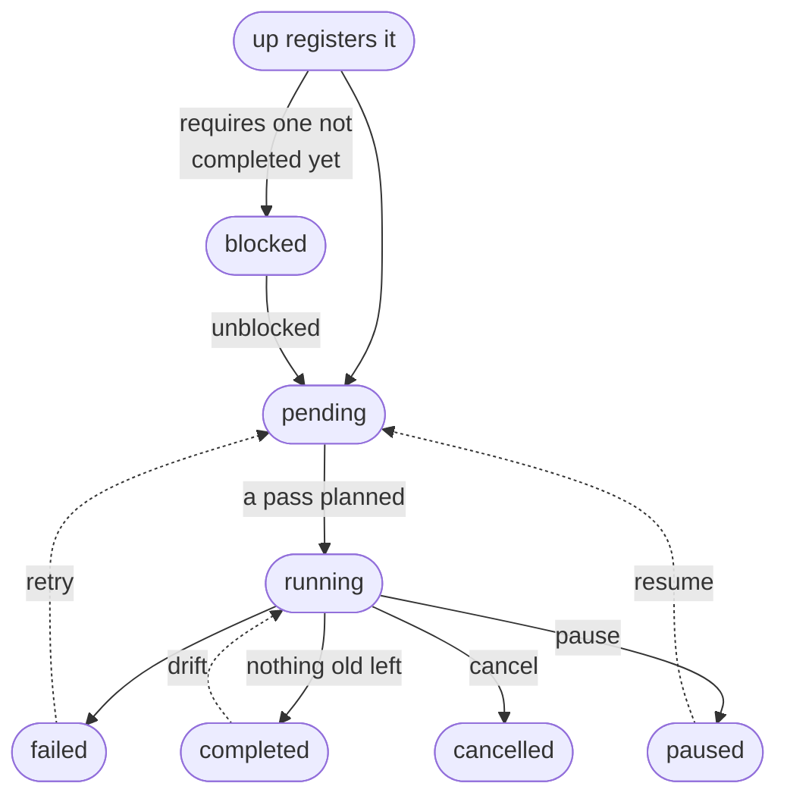
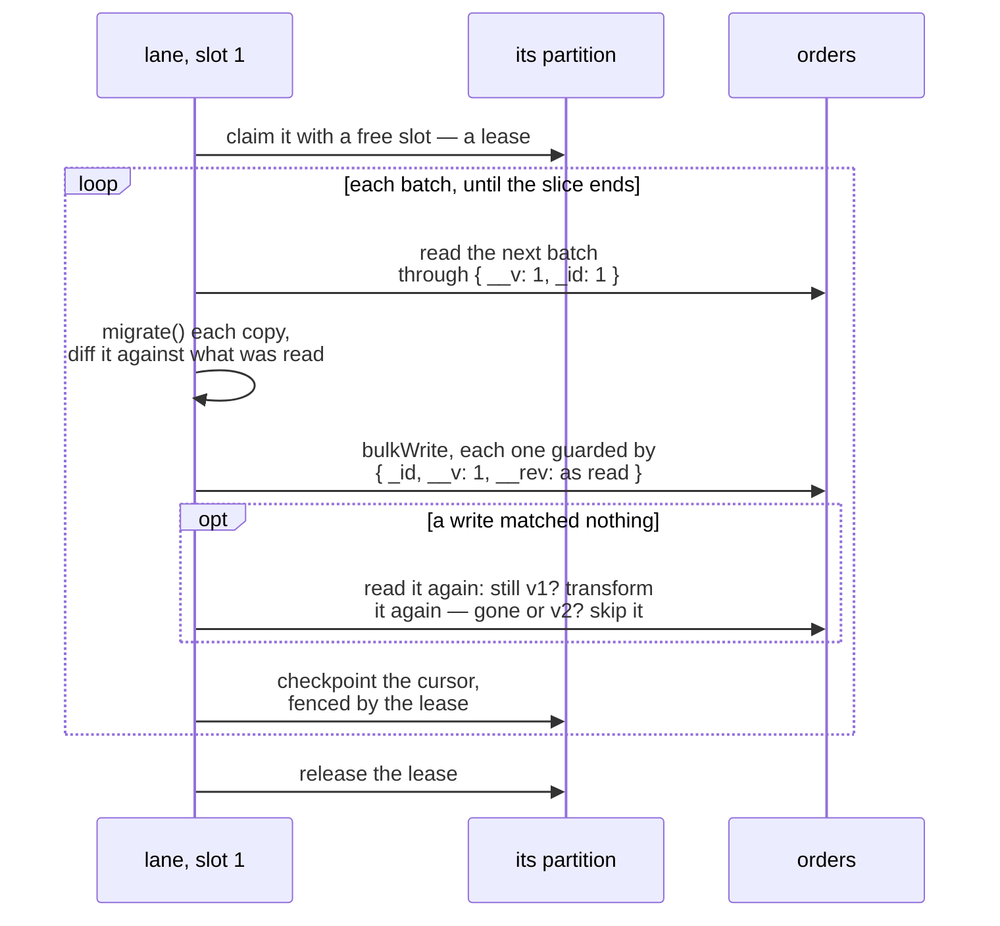
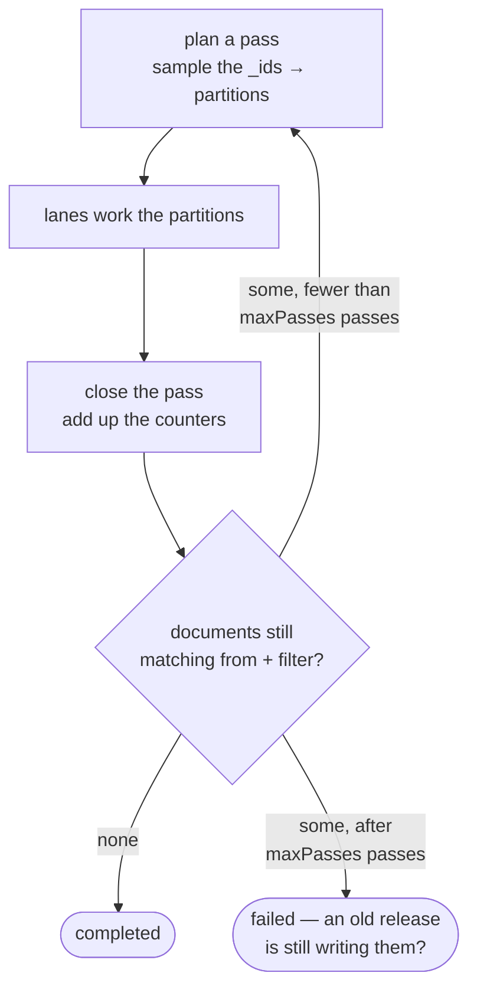
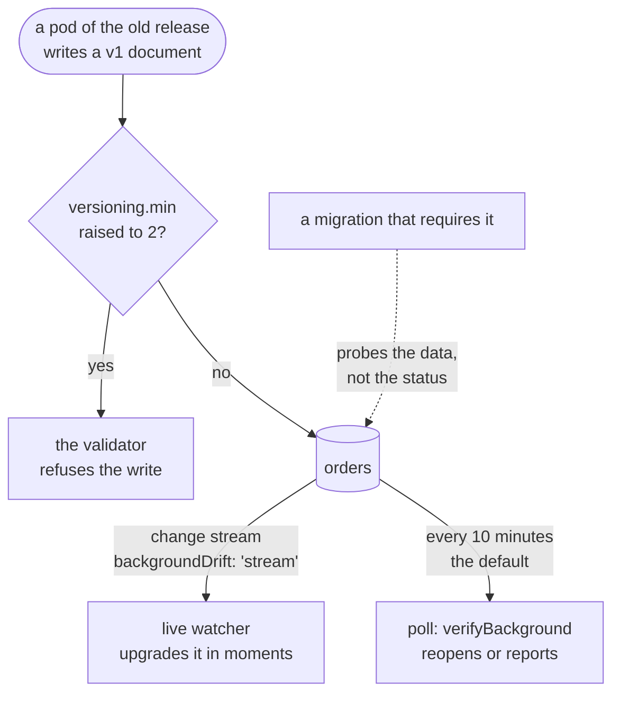

# Background Migrations

Some data changes are too big for a deploy. Rewriting every document of a large collection can take
hours. As an ordinary migration, it would hold the migration lock the whole time and block
everything behind it: the next migration, `converge`, and every pod that runs `migronaut up` on
boot. It would also have no checkpoint, no progress and no way to pause, and one failure would stop
the line.

A **background migration** is the other way to make that change. It is a file in your migrations
directory that exports `background = { … }` instead of `up`/`down`. Applying it only **registers**
it, and the line goes on. The documents are rewritten beside the line, as long as that takes:

- in **partitions**, by **lanes** in any number of processes (the CLI, your application, a BullMQ
  worker);
- with a checkpoint after every batch, so a restart or a deploy loses at most one batch;
- with progress, throttling, pause/resume/cancel, a dry run, and a watch for documents that come
  back in the old shape afterwards.

None of that holds the migration lock.



::: warning Experimental
New in 2.3. The file format, the kit methods, the result shapes and the queue job contract may
still change in a minor release.
:::

A background migration rewrites documents from one **shape version** to the next: the version
field (`__v`) and revision field (`__rev`) described in [Document Versioning](/guide/versioning).
The usual release follows [that page's pattern](/guide/versioning#a-release-end-to-end):

1. **Expand.** The application reads both shapes and writes the new one. The same deploy registers
   the background migration.
2. **Background update.** The documents move to the new shape while the application runs.
3. **Contract.** A later migration `requires` the background migration, so it applies only once
   every document has the new shape. Raising `versioning.min` then makes the validator refuse the
   old shape.

## Writing one

```js
// migrations/20261004120000-orders-shipping.js
export const description = 'Move address into shipping';

export const background = {
  collection: 'orders',
  from: 1, // documents at version 1 …
  to: 2, //   … become version 2
  migrate: ({ address, ...doc }) => ({ ...doc, shipping: { address } }),
  revert: ({ shipping, ...doc }) => ({ ...doc, address: shipping.address }),
  maxParallel: 4, // up to 4 partitions at once, across every process
};
```

`migronaut create orders-shipping --background` writes a skeleton of such a file (with `--ts` or
`--js`, as usual).

What the engine does with it:

- **What it rewrites.** It rewrites every document of `collection` whose version field is `from`
  and that matches `filter`, if one is given. `from: 0` means documents without a version: the field
  missing, `null` or `0`. `filter` must not mention the version field, because `from` and `to`
  already constrain it.
- **`migrate(doc, ctx)` returns the whole new document.** It gets a copy, so it may change it in
  place. The engine compares the result with what it read and writes only the difference:
  - it `$set`s the top-level fields that changed and `$unset`s the ones that went (a field left out
    of the result is removed);
  - it sets the version to `to` and increments the revision.

  The system fields in the result are ignored, because migronaut writes them. A different `_id`, a
  result that is not a document, or a field name with a `$` or a `.` fails that document. Writing
  only the difference keeps the stored BSON type of every field you did not touch.
- **Every write is guarded.** The filter is the `_id` with the exact version and revision that were
  read. A document the application changed in the meantime matches nothing. It is read again: if it
  still has the old shape, it is transformed again, up to `maxConflictRetries` rounds; if it is
  gone or already has the new shape, it is skipped. Whatever is still in the way is left to the
  next [pass](#partitions-lanes-and-passes).
- **`migrateBatch(docs, ctx)`** takes the place of `migrate` when the transformation is cheaper per
  batch. It returns one result per document, in order. An `Error` in a slot fails just that
  document. A throw, or an array of the wrong length, fails the whole slice.
- **`revert` / `revertBatch`** are the way back, used by `down`. Without one, a background
  migration is one-way (see [`down`](#up-down-redo)).

`ctx` holds `signal` (aborted when the slice stops), `logger`, `direction` (`'forward'` or
`'revert'`), and `background: { name, generation, partition, runId?, jobId?, attempt }` — frozen;
`runId` is the lane's, `attempt` counts the transactions a transactional batch went through.
`logger` binds it to every line, and a `userland: true` line emits
[`migration:log`](/guide/migration-logs#background-migrations) — log per batch, not per document.
In a dry run it also has `dryRun: true`, and its lines emit nothing. It holds `session`, `db` and `client` only in [transactional
mode](#transactions-and-writes-to-other-collections). Outside it, `migrate` should be a pure
function of the document.

A background migration file exports **no `up` or `down`**. A file with both is refused. Expand
steps, such as a new index or a new field, go in an ordinary migration of their own.

### The collection's versioning

When the collection is [declared](/guide/collections) with `versioning`, the background migration
takes its field names from there. `to` may not go past `versioning.current` ("raise current first").
A collection declared without revisions must say `occ: 'version-only'`: its guard can then see
only a concurrent write that changed the version, and **a concurrent write that leaves the version
alone is lost**. A collection that is not declared uses `__v` and `__rev` unless `versionField` /
`revisionField` say otherwise.

Every scan goes through the **version index**, `{ __v: 1, _id: 1 }`, which converge creates for a
collection declared with `versioning`. On a sharded collection the index is
`{ __v: 1, …shard key, _id: 1 }`. Without the index, migronaut warns once and scans the
collection.

### Settings

Every setting sits next to `collection` in the same object.

| Setting | Default | Meaning |
|---|---|---|
| `batchSize` | `500` (`100` with `transaction`) | Documents per batch, 1–10 000 |
| `pauseMs` | `100` | Pause between batches |
| `sliceMs` | `30000` | How long a lane holds a partition before it yields (≥ 1000) |
| `writeConcern` | `{ w: 'majority' }` | Of every batch write. `w: 0` is refused: an unacknowledged write cannot see a conflict |
| `maxDocumentErrors` | `0` | Documents that may fail before the background migration does, at most 1000 (see [Document errors](#document-errors)) |
| `maxPasses` | `10` | Passes over what is left before it fails |
| `maxConflictRetries` | `3` | Rounds of re-reading documents a concurrent write moved under a batch |
| `maxSliceFailures` | `3` | Failed slices of one partition in a row before that partition fails |
| `maxReplicationLagMs` | `10000` | Wait while a secondary lags more than this; `false`: never wait |
| `throttle(ctx)` | — | Called before every batch; a number it returns is an extra pause in ms |
| `maxParallel` | `1` | Partitions worked at once, across every process (1–64) |
| `partitions` | see below | How the collection is split |
| `transaction` | `false` | `true` or `{ timeoutMs: 10000, maxRetries: 5 }`: each batch and its checkpoint in one transaction |
| `adaptive` | `true` | The latency-driven throttle: `false`, or `{ targetLatencyMs: 500, minBatchSize: 10, maxBatchSize, maxPauseMs: 30000 }` |
| `shardConcurrency` | `1` | Lanes per shard on a [sharded collection](#sharded-clusters) (1–64) |
| `occ` | `'revision'` | `'version-only'` for a collection without revisions |
| `versionField` / `revisionField` | the collection's, else `__v` / `__rev` | The system field names |
| `description` | — | Shown in status |

`partitions` takes `{ overPartition, maxPartitions, minPartitionDocs, sampleSize }`:

| Key | Default | Meaning |
|---|---|---|
| `overPartition` | `4` | Partitions per lane, so one slow partition does not hold up the pass |
| `maxPartitions` | `256` | Upper bound on partitions per pass |
| `minPartitionDocs` | `4 × batchSize` | No partition is planned smaller than this |
| `sampleSize` | `min(10000, 100 × partitions)` | `_id`s sampled to place the boundaries |

Every value is checked, and an unknown key is an error. The key `partitioner` is reserved: partitions
always follow `_id`, or the shard key, automatically.

### `step`: the escape hatch

Some changes are not "one document in, one document out": moving documents to another collection,
deleting in chunks, or backfilling from an external source. For those, write a `step`:

```js
// migrations/20261010120000-archive-events.js
export const background = {
  collection: 'events', // shown in status, nothing more
  async step({ db, checkpoint }) {
    const after = checkpoint?.lastId;
    const batch = await db
      .collection('events')
      .find({ archived: { $ne: true }, ...(after ? { _id: { $gt: after } } : {}) })
      .sort({ _id: 1 })
      .limit(500)
      .toArray();
    if (batch.length === 0) return { checkpoint, done: true };
    await db.collection('events_archive').bulkWrite(
      batch.map((doc) => ({
        replaceOne: { filter: { _id: doc._id }, replacement: doc, upsert: true },
      })),
    );
    await db
      .collection('events')
      .updateMany({ _id: { $in: batch.map((doc) => doc._id) } }, { $set: { archived: true } });
    return { checkpoint: { lastId: batch.at(-1)._id }, done: false, processed: batch.length };
  },
};
```

Migronaut calls `step` again and again, each time with the checkpoint the previous call returned,
until it returns `done: true`. Migronaut owns the lease, the slices, the throttle, the controls and
the failure counting. The step owns everything it writes.

- **`ctx`** holds `db`, `client`, `checkpoint` (`null` the first time), `deadline` (epoch ms: return
  by then, because the slice ends), `signal`, `logger`, `direction` and `background`. With
  `transaction`, it also holds `session`.
- **It returns `{ checkpoint, done, processed?, migrated?, total? }`.** The checkpoint is stored on
  the partition and may be at most 64 KiB of BSON: keep a cursor in it, not data.
- **One partition.** A step background migration runs as a single partition, so `maxParallel` must
  be `1`.
- **Writes must be idempotent.** A crash between the step's writes and its checkpoint runs the step
  again from the old checkpoint. With `transaction: true`, writes that pass `ctx.session` commit
  together with the checkpoint, so a step that is run again leaves no duplicates.
- **`revertStep`** is its way back for `down`.
- **Done is what the step says.** No count of what is left decides it, and the
  [drift watch](#drift-after-completion) cannot probe it.

`from`, `to`, `filter` and `migrate` do not belong in a step background migration and are refused.

## `up`, `down`, `redo`

`up` applies a background migration file like any other: hooks, a span, the transaction (with
`useTransaction`, the registration and the changelog record commit together), and a changelog
record with `kind: 'background'`. Its body only **registers** the background migration: a state
document in `_migronaut_background`, logged as `⧗ Registered` and emitted as
`background:registered`. No document is touched, and the line goes on. The spec is validated first:
an invalid one fails as `MIGRATION_INVALID_EXPORT` (exit 20) before anything is written.

A registered background migration moves through these statuses:

| Status | Meaning |
|---|---|
| `blocked` | Waits for background migrations it [`requires`](#between-background-migrations) |
| `pending` | Registered, not planned yet |
| `running` | Planned: lanes work its partitions |
| `paused` | Stopped by `pause`, with every cursor kept |
| `completed` | Nothing of the old shape is left |
| `failed` | A partition failed, the document error budget ran out, or `maxPasses` passes did not drain it |
| `cancelled` | Stopped by `cancel` |



`pause` and `cancel` work on a `blocked` or `pending` one too, and a paused one can be cancelled.
A cancelled one can be retried like a failed one, and drift reopens a completed one
([below](#drift-after-completion)).

A control that does not fit the status fails with `BackgroundConflictError` (exit 33), for example
pausing a completed one. A control whose result is already in place is not an error: it answers
`applied: 'unchanged'`, so a repeated click or a redelivered job is harmless.

**`down`**: what it does depends on whether the background migration declares a way back.

- **With `revert`**, the forward background migration is replaced by the way back: it is
  registered again as `pending` with `direction: 'revert'`, and lanes rewrite the documents at `to`
  back to `from` like any other background migration. Reverting to `0` removes the version field
  and still bumps the revision. **Roll the application back first.** A release that still writes
  the new shape would undo the revert as it goes. The [live drift watcher](#the-live-watcher) stands
  aside on a collection while a revert works on it.
- **Without `revert`**, the background migration is withdrawn (its state removed), but only while
  no document has been rewritten. After that, `down` and `dry-run down` refuse with
  `IrreversibleMigrationError` (exit 13). Write a background migration back instead. Once a plan
  exists, `down` first pauses it and waits for its lanes (each stops at its next batch boundary),
  so the check sees every batch they wrote; a refused `down` resumes it. A `step` migration counts
  as having rewritten documents as soon as one step was checkpointed, whether or not it returned
  `migrated`.

**`up --force` and `redo`** register it again. It gets a new `registration` id, the old plan's
partitions are deleted, and the pass count goes back to 0. Its history is kept, and the old
registration is summed up as `previous` (status, direction, passes, totals). Documents already at `to` no longer
match, so it covers only what is left. `redo` is a `down` and an `up`: it ends registered forward,
and it is refused like `down` when there is no `revert` and documents were already rewritten.

## Running it

A registered background migration needs something to run its lanes. There are three runtimes, and
they share one model in MongoDB: mix them, run several of each, restart any of them at any time.
`maxParallel` holds across all of them together.

### From the command line

```bash
migronaut background run 20261004120000-orders-shipping.js --concurrency 4
migronaut background run --all          # every runnable one, oldest registration first
```

The process runs the coordinator and up to `--concurrency` lanes (never more than `maxParallel`)
until the background migration is done. Ctrl-C stops the lanes at their next batch, and a later run
continues from there. See [`migronaut background`](/commands/background).

### Inside your application: `startBackgroundRunner`

```js
const { startBackgroundRunner } = require('@alexify/migronaut');

const runner = startBackgroundRunner({
  config: { uri: process.env.MIGRONAUT_URI, dbName: 'my_app' },
  concurrency: 2,
  onError: (error, migration) => log.warn({ err: error, migration }, 'background slice failed'),
});

process.on('SIGTERM', () => runner.stop()); // stops at the next batch, releases every lease
```

| Option | Default | |
|---|---|---|
| `kit` / `config`, `kitOptions` | — | A kit you own, or the config for one the runner makes and disconnects on `stop()` |
| `concurrency` | `1` | Lane loops in this process (≤ 64), shared round-robin by every runnable background migration — never more than one migration's `maxParallel` on it |
| `pollIntervalMs` | `5000` | How often the list of runnable background migrations is read again |
| `sliceMs` | each one's `sliceMs` | A slice's length |
| `verifyIntervalMs` | `600000` | The [drift watch](#the-poll-verifybackground)'s period; `false` turns it off |
| `watch` | `backgroundDrift` is `'stream'` or `'both'` | Host the [live drift watcher](#the-live-watcher): `true`, `false` or its options |
| `signal` | — | Stops the runner, like `stop()` |
| `onError` | — | Hears every failure. The runner itself never throws: a failed slice backs off that migration |

It returns `{ kit, running, watcher, stop() }`. Every instance of your application can run one,
and they share the work through the leases.

### On a queue

With BullMQ, background migrations get a queue of their own: a coordinator job each, with its
lanes as child jobs. See [Background migrations on the queue](/guide/bullmq#background-migrations-on-the-queue).

### Inline: `backgroundInline`

For small collections and tests, `backgroundInline: true` (or `MIGRONAUT_BACKGROUND_INLINE=true`)
makes `up` run each background migration to the end right after registering it. It runs under the
migration lock, with `maxParallel` lanes, and runs anything it requires first. A failure fails the
`up` with `BACKGROUND_FAILED` (exit 32), and a stop fails it with `RUN_ABORTED` (exit 11). A file
changed since it was registered fails it with `CHECKSUM_MISMATCH` instead of waiting for a deploy
to finish (this run *is* the deploy): pin the new version with `migronaut background repin`.

Inline mode holds the line for as long as the rewrite takes, which is the very thing background
migrations exist to avoid. Keep it for data you know is small.

The lanes it runs are lanes of their own — each with its own `runId` — but they work for the run:
when that run names a queue job (the [BullMQ adapter](/guide/bullmq) always does, or the `job`
option), `ctx.background.jobId` and `groupId` name it, and so do the lanes' log lines and
[`migration:log`](/guide/migration-logs#background-migrations) events, which land in that job's
log.

### The kit methods

The runtimes are built on public kit methods, which you can drive yourself:

| Method | |
|---|---|
| `runBackground(name, { signal?, sliceMs?, untilDone?, concurrency? })` | Run the coordinator and up to `concurrency` lanes in this process until it is done (or one round with `untilDone: false`). Throws `BackgroundFailedError` if it fails, `RunAbortedError` if stopped. A failed slice is retried with a backoff; an error no retry fixes (the file changed or is gone, the deployment cannot run it), or 10 failed slices in a row, ends it with that error. `sliceMs` (1 to 3 600 000) overrides the spec's; a slice always works one batch first |
| `coordinateBackground(name, { signal?, driver? })` | One coordinator step: `{ next: 'process' \| 'wait' \| 'done' \| 'busy' \| 'superseded', lanes?, … }` |
| `runBackgroundSlice(name, { signal?, sliceMs? })` | One slice of one lane: `{ outcome, counters }`, where `outcome` is `yielded`, `exhausted`, `busy`, `stale`, `paused`, `cancelled`, `failed`, `stopped` or `lost` |
| `runnableBackground()` | The background migrations with work to do. Blocked ones whose requirements are met are unblocked on the way |

None of the background methods is a run: they take no migration lock, and one kit may drive many
at once.

## Partitions, lanes and passes

Several parts work together, and they keep everything that matters in MongoDB:

- **The coordinator** plans the partitions, starts lanes, and closes each pass. It runs one step at
  a time under a lock of its own (`background:<name>`, in `lockCollection`), held only for that
  step. It never touches the migration lock, and `migronaut unlock` never touches its lock.
- **A partition** is a range of `_id` (or of the shard key) with its own cursor, counters and
  lease.
- **A lane** claims a partition together with a **slot** (`0` to `maxParallel − 1`). It works the
  partition in batches until its slice (`sliceMs`) ends, then releases it. A unique index on the
  slots is what caps lanes at `maxParallel` across every process.
- **A batch** goes in four steps. It is read through the version index and transformed. Then it is
  written as one unordered, guarded `bulkWrite`, and the partition's cursor moves forward in one
  checkpoint that is fenced by the lease. A crash between the write and the checkpoint replays the
  batch, which the version filter turns into a no-op.



**How the collection is split.** With `maxParallel: 1` there is one partition (one per `_id` type,
when the collection mixes them). Otherwise the plan aims for `overPartition × maxParallel`
partitions, capped at `maxPartitions` and never smaller than `minPartitionDocs`. The boundaries come
from a sample of the matching `_id`s, sorted by the server.
`_id`s of different BSON types never share a partition. If the sample takes more than 30 seconds,
the pass falls back to one partition per type (`plan.degraded: 'sample-timeout'`). The largest
partitions are worked first.

**Leases.** A lease lasts `lockTTLSeconds` (60 s by default) and is renewed while its lane works,
and every checkpoint renews it too. If a lane dies, even with `kill -9`, its lease expires: the next
claim takes over the partition and resumes from the last checkpoint. A lane that loses its lease, to
a long GC pause for example, finds out at its next checkpoint and stops at that batch boundary.

**Passes.** When no partition of the current pass is open, the coordinator closes it. It adds the
partitions' counters into the totals and **counts what is left**: documents that still match `from`
and `filter`.

- None left: the background migration is `completed`, and anything that required it is unblocked.
- Some left, for example after conflicts or because an old application version wrote more: the
  next pass, a new **generation**, covers just those documents.
- Still some left after `maxPasses` passes: it fails with "old-shape documents keep appearing … is
  an old version of the application still writing them?".



Completion is decided by that count alone. Partitions only spread the work, so a gap between them
is found by the count and an overlap is kept apart by the guarded writes.

### Document errors

A document fails when its transformation throws or returns something unusable, when the validator
rejects the write (121), when the write hits a unique index (11000), or when the write would
[change the shard key](#sharded-clusters). Failed documents are counted by distinct `_id` across
every partition and pass:

- **Over `maxDocumentErrors`** (default `0`, so the first one), the background migration fails.
  Other lanes see that at their next batch boundary.
- **Within the budget**, failed documents are left out of later passes and of the final count. The
  background migration completes with a warning, and `audit` keeps warning, because those documents
  still have the old shape. `retry --from-start` or a new registration clears the list.

Migronaut never logs a failed document's `_id` or contents: they are your application's data.

A slice that fails as a whole (a lost connection, a `writeConcernError`, a throwing `migrateBatch`)
is counted on its partition. The partition fails after `maxSliceFailures` failed slices in a row (a
checkpoint in between starts the count again), and a failed partition fails the background
migration when its pass closes. A lane stopped by its process (a shutdown, a deploy) is not a
failed slice: it releases its lease and the next lane resumes from the last checkpoint.

## `requires`: waiting for a background migration

### Contract migrations

An ordinary migration that must not run before a background migration has finished says so:

```js
// migrations/20261101120000-orders-drop-address-index.js
export const requires = ['20261004120000-orders-shipping.js'];

export async function up({ db }) {
  await db.collection('orders').dropIndex('address_1');
}

export async function down({ db }) {
  await db.collection('orders').createIndex({ address: 1 });
}
```

- `requires` lists bare file names, with no duplicates. Each one must sort **before** the file and
  be a background migration file: ordinary migrations already run in order.
- **The data decides.** A requirement is met when the background migration is `completed` **and**
  its collection has no document left in the old shape, which one indexed probe checks. If the
  probe finds one, an old pod wrote it since: the background migration is reopened and waited for
  again. A step background migration cannot be probed, so for it only its status counts.
- A `baseline` or `import` record of the required file counts as done, because that history
  predates migronaut.
- The check runs **before `beforeEach`**: a migration that cannot run yet fires no hook and leaves
  no failed record.

When a requirement is not met, `up` stops at that migration in one of two ways:

- **`onBackgroundPending: 'error'`** (the default) throws `BackgroundPendingError` (exit 31).
  `error.context.waitsFor` lists `[{ migration, status }]`. The CLI's `migronaut up` always behaves
  this way.
- **`onBackgroundPending: 'stop'`** ends the run there cleanly. Everything before that migration
  applies, `background:waiting` is emitted, and `runMigrations` reports where it stopped. That lets
  an application boot while its background migration runs:

```js
const summary = await runMigrations(config, { onBackgroundPending: 'stop' });
if (summary.waiting) {
  // [{ migration: '20261101…-orders-drop-address-index.js', waitsFor: [{ migration, status }] }]
}
```

`kit.up(undefined, { onBackgroundPending: 'stop' })` takes the same option. A `dryRun('up')` row
says `kind: 'background'` for a background file (as `status()` does), and `requires` / `waitsFor`
for a migration that waits. In [inline mode](#inline-backgroundinline) the required background
migrations run first, right there.

### Between background migrations

A background migration may `requires` another one too, for example `v2 → v3` after `v1 → v2`. It
registers as `blocked`, with `waitsFor`, until every background migration it requires has
completed, and is unblocked then (`background:unblocked`). A required one that failed keeps it
blocked, and `audit` warns. Since every `requires` entry names an earlier file, the requirements can
never form a cycle.

## Transactions and writes to other collections

With `transaction: true`, each batch runs as one snapshot transaction: the read, the
transformations, the guarded writes and the fenced checkpoint commit together or not at all.

- **The counters are exact**, because the data, the counters and the cursor commit as one.
- **A lane that lost its lease cannot commit**, because its checkpoint is the transaction's last
  write and matches nothing.
- **Side writes are possible.** `ctx` holds `session`, `db` and `client`, so a transformation can
  write elsewhere, atomically with the document it migrates.

```js
export const background = {
  collection: 'orders',
  from: 1,
  to: 2,
  transaction: true, // or { timeoutMs: 10000, maxRetries: 5 }
  async migrate(doc, { db, session }) {
    await db
      .collection('customers')
      .updateOne({ _id: doc.customerId }, { $addToSet: { shipTo: doc.address } }, { session });
    const { address, ...rest } = doc;
    return { ...rest, shipping: { address } };
  },
};
```

::: warning Pass the session, every time
A write without `session` is not part of the transaction. It commits at once, even when the batch
is aborted and retried, and `migrate` can run several times for one document before a batch
commits. Only writes made with `ctx.session` are undone with the batch.
:::

The transactional mode needs a replica set or a mongos. On a standalone server the background
migration fails ("run it with transaction: false"). Batches default to 100 documents and read at
most 8 MiB. Errors are handled like this:

- **Transient transaction errors** are retried with jittered backoff up to `maxRetries` times, and
  the batch is halved after half of them.
- **A batch that ran out of time or size** is halved at once.
- **A batch of one** that keeps conflicting is passed over, and the next pass picks it up. A batch
  of one that is too big or too slow is a document error.
- **Clean batches** grow back by ×1.5.

`timeoutMs` is capped at 50 000, under MongoDB's 60-second transaction lifetime. Hot documents in
another collection that many batches write to serialize the lanes through write conflicts. For those,
`maxParallel: 1` is the honest setting.

## Throttling

A background migration rewrites a production collection while your application uses it. Before
every batch, a lane waits for each of these in turn:

1. **`pauseMs`**, the fixed pause between batches.
2. **Your `throttle(ctx)` hook.** It gets `{ name, collection, generation, partition, batchSize,
   signal }`, and a number it returns is an extra pause in ms:

   ```js
   throttle: async () => ((await isPeakHour()) ? 2000 : 0),
   ```

3. **Replication lag.** On a replica set, the lane waits while a secondary lags more than
   `maxReplicationLagMs`. The lag is read with `replSetGetStatus` at most every 5 s, and hidden and
   delayed members are left out. Reading it needs the `clusterMonitor` role. Without the role,
   migronaut warns once and stops waiting for secondaries. On a standalone server or behind a
   mongos it is quietly off.

**The adaptive throttle** (`adaptive: true`, the default) sizes batches by how long their writes
take, additive increase and multiplicative decrease:

- **A healthy batch** grows the next one a little.
- **A slow or overloaded batch** halves it. Slow means slower than `targetLatencyMs`; overloaded
  means a write concern timeout, a transient error or a lagging secondary. It halves at most once
  per round trip.
- **At `minBatchSize`** it backs off in time instead: an extra pause that doubles up to
  `maxPauseMs`, then shrinks again as things recover.

It never grows past your `batchSize`. Each process keeps one controller per background migration
(and per shard), and the state is saved on the partition. It works on every topology: behind a
mongos and on a standalone server it is the only signal there is. Changes are reported as
`background:throttle`, at most every 10 s.

## Dry runs

Look before you `up`. A dry run reads real documents and writes nothing, and it works for a file
that is not registered yet:

```bash
migronaut background dry-run 20261004120000-orders-shipping.js              # 5 random documents
migronaut background dry-run 20261004120000-orders-shipping.js --first 20   # the first 20 by _id
migronaut background dry-run 20261004120000-orders-shipping.js --validate   # through the real write path
migronaut background dry-run 20261004120000-orders-shipping.js --revert     # the way back
```

- **On a sample** (`--sample n`, 1–1000, default 5, or `--first n`), each document comes back as
  it is (`before`), as it would be written (`after`), and with the update that would write it
  (`change`), or with the error it would fail with. Only the transformation runs, so this works on
  any server.
- **With `--validate`**, each document goes through the real write path: the diff, the guarded
  write and the side writes. That happens inside a **sandbox**, a transaction that is always
  aborted. What comes back is what the server would have stored, what the validator or a unique
  index would have refused, and which documents of other collections the side writes touched
  (`sideEffects`). It needs a replica set or a mongos (exit 15 otherwise).
- **A `step` migration** is dry-run by steps (`--steps k`, 1–50, default 1) in the same sandbox.
  Each step gets the checkpoint the one before it returned, and sees what the earlier steps wrote.
  It starts from the checkpoint the background migration is at, or from none with `--from-start`.
  The report lists every operation, with its filter, and up to `--max-docs` (default 20) before and
  after images of the documents it changed. The sandbox stops at `--deadline-ms` (default and
  maximum 50 000).

The sandbox runs code against your real database, so it lets through only what can run inside that
transaction. It is an allow-list that **fails closed**:

| Object | Allowed (the sandbox supplies the session) | Refused |
|---|---|---|
| Collection | `find`, `findOne`, `aggregate`, `countDocuments`, `distinct`, the insert / update / replace / delete methods, `findOneAnd*`, `bulkWrite` | Index and search index changes, `drop`, `rename`, `estimatedDocumentCount`, metadata, `watch`, … |
| Db | `collection(name)`, `aggregate` | `command`, `admin`, creating, dropping or renaming collections, `listCollections`, `stats`, `watch`, … |
| Client | `db()` for the kit's database | Another database, `startSession`, `withSession`, `close`, … |
| Session | `inTransaction()`, `id` | Starting, committing or ending anything |
| Cursor | Builders (`sort`, `limit`, `project`, …) and terminals (`toArray`, `next`, `forEach`, `for await`) | `explain`, `stream`, anything else, and any use once it is closed |
| Mongoose | — | Any model: models bypass the session |

Migronaut's own collections and `system.*` are off limits. So are another session, a
`writeConcern` / `readConcern` / `bypassDocumentValidation` option, a read from a secondary, and the
aggregation stages `$out`, `$merge`, `$changeStream`, `$currentOp` and the other stages that cannot
run in a transaction. A refused call throws `SandboxRefusedError`. Every refusal lands in the report
and makes the CLI exit `34`, **even when your code caught the error**.

::: warning A guard rail, not a security boundary
Code that kept a client of its own, or requires the driver itself, can reach past the proxies. The
sandbox catches mistakes. It does not contain hostile code.
:::

A sandbox transaction holds write locks on the documents it touched until it aborts, so concurrent
application writes to them get a write conflict and retry. Dry-run off-peak, or with few steps.
What the sandbox records is returned to you in the report; none of it goes to the logs.

## Drift: after completion

A background migration completes, and then a pod that still runs the old release writes the old
shape again. So can a forgotten worker or another service. There are three lines of defence:

1. **The validator.** Once the contract release raises `versioning.min`, the database refuses the
   old shape. Converge refuses to raise `min` while documents below it remain; see
   [Document Versioning](/guide/versioning).
2. **The data checks.** The [`requires`](#requires-waiting-for-a-background-migration) check and
   converge's `min` guard both look at the documents, not at the status.
3. **The drift watch**, for the window between `completed` and the contract release, or for
   projects that never raise `min`. It runs in one of two forms: a periodic **poll**, and a **live
   watcher** that follows change streams.



### The poll: `verifyBackground`

```js
const { checked, skipped, drift } = await kit.verifyBackground(); // { onDrift?, collections? }
```

It runs one indexed probe per completed forward (declarative) background migration, looking for a
document of its old shape. It skips:

- a collection where another background migration is still at work;
- a background migration with `to ≤ versioning.min`, because the validator guards that one;
- a collection without the version index.

What a finding does is `backgroundOnDrift` (or `onDrift`):

- **`'reopen'`** (the default) moves the background migration from `completed` back to `running`,
  with a new pass over what is left. It is not a reset: the pass counts toward `maxPasses`, so a
  release that keeps writing the old shape eventually fails it, loudly.
- **`'report'`** only emits `background:drift`, counts the metric and warns.

The result lists `drift: [{ migration, collection, action }]`, never a document id. The poll runs
every 10 minutes in the [runner](#inside-your-application-startbackgroundrunner) and on the
[queue](/guide/bullmq#background-migrations-on-the-queue). `migronaut background verify` runs it
once (exit 31 on drift), and `audit` reports what it would find.

### The live watcher

With `backgroundDrift: 'stream'` (or `'both'`), a **change stream** follows each collection that
has a completed background migration. An old-shape write is upgraded moments after it lands,
instead of at the next poll. The upgrade goes through the lanes' own write path: the
transformation, the guarded write, the shard-key guard and, in transactional mode, the side writes.
A chain (`v1 → v2 → v3`) is upgraded one step at a time.

| `backgroundDrift` | |
|---|---|
| `'poll'` (default) | The poll only |
| `'stream'` | Live watchers, with the 10-minute poll as a backstop. The poll skips a collection whose watcher is streaming |
| `'both'` | Both, in full |

The runner and the queue's background worker host the watcher when `backgroundDrift` asks for it.
You can also start it yourself with `kit.watchBackground(options)`, or in the foreground with
`migronaut background watch`.

- **One leader per collection**, across every process. The leader is the watcher holding the
  `watch:<collection>` lock. The others retry now and then (`leaderRetryMs`, jittered), which
  spreads the collections over your pods.
- **Resume tokens** are kept in `<backgroundCollection>_watch`, saved at most every `checkpointMs`.
  While the stream is idle the leader saves its post-batch token, so a quiet, filtered stream does
  not fall off the oplog.
- **Nothing falls between the start and the stream.** A first start opens the stream before it
  probes the collection's past (`catching-up`).
- **A lost history** (the oplog moved past the token) starts over from now, after one more probe
  (`history-lost`).
- **A stream that falls behind** by more than `maxLagMs` gives up on its backlog. Its background
  migrations are reopened as ordinary ones and it starts again from now (`overloaded`). A watcher
  must not turn into a slow background migration of its own.
- **It stands aside on a collection while a revert works on it** (`suspended`), since it would
  upgrade straight back what the revert rewrites. It never upgrades with a background migration
  that is not completed.
- **A document it cannot upgrade** emits `background:drift` with `action: 'failed'` and, with
  `backgroundOnDrift: 'reopen'`, reopens the background migration.
- **Missing permissions or too many collections.** A collection it may not watch is left to the
  poll (`fallback`). Past `maxCollections` collections per process, the rest are left to the poll
  too, with a warning.
- **A standalone server has no change streams.** `watchBackground()` rejects with `CONFIG_INVALID`.
  A runner or worker that hosts the watcher logs that and keeps the poll.

The stream carries no documents. Its pipeline matches only inserts and replaces of an old shape,
and updates that touch the version field; for each such event the watcher reads the one document
the event names.

| Option of `watchBackground` | Default | |
|---|---|---|
| `collections` | every collection with a completed background migration | Only these |
| `upgrade` | `true` | `false`: report old-shape writes, never upgrade them |
| `refreshMs` | `30000` | How often the background migrations and collections are read again |
| `checkpointMs` | `5000` | The most often a resume token is saved |
| `leaderRetryMs` | `10000` | How often a follower tries to lead |
| `maxCollections` | `16` | Collections watched by this process |
| `maxLagMs` | `60000` | Lag past which the stream gives up its backlog |
| `signal`, `onError` | — | Stop the watcher; hear every failure (the watcher never throws) |

`refreshMs` is at least 100 ms, `checkpointMs` and `leaderRetryMs` at least 10 ms; an option it does
not know is refused. Lag is measured against the server's clock (`hello`), so a host whose clock
runs ahead does not read every event as late. A document the watcher cannot upgrade (it keeps losing
to other writes, or the migration's file is mid-deploy) goes back to the lanes: with
`backgroundOnDrift: 'reopen'` its background migration is reopened, otherwise the drift is reported.

It returns `{ running, status(), stop() }`. `status()` gives, per collection, the `state`
(`following`, `catching-up`, `streaming`, `history-lost`, `overloaded`, `restarting`, `suspended`,
`fallback` or `stopped`), whether this process leads it, and counters. `kit.backgroundWatchStatus()`
reads what every leader recorded (never the token).

## Sharded clusters

On a sharded collection a background migration is **shard-aware** by default
(`backgroundShardAware: 'auto'`; `'off'` treats every collection alike):

- **Partitions follow the chunks.** A partition covers a run of adjacent chunks on one shard, and
  is split further at sampled shard-key quantiles (or arithmetically, for a hashed first field)
  when that shard's lanes want more, aiming for at most 8 per shard. When the chunks cannot be
  read, the key space is sampled instead.
- **`shardConcurrency`** (default 1) caps the lanes per shard, with a second unique slot index.
  `maxParallel` still caps the total.
- **Reads are targeted on a ranged key.** A batch reads the version index between exact bounds,
  plus a predicate on the first shard-key field that lets the mongos pick the shard. When it picks
  shards, a mongos treats a `$lt` bound as inclusive, so a partition, which ends where its run of
  chunks ends, reads from at most two shards: its own and the next chunk's. A ranged key keeps a
  keyset cursor.
- **A hashed key drains.** There is no cursor to keep, since the hash of the last document read is
  the server's to compute: every batch starts at the start of the range, and rewritten documents
  leave it by themselves. Up to 100 documents that stay in the range are stepped over by id, and
  the rest are left to the next pass. A hashed first field gives the mongos nothing to target, so
  those reads go to every shard; the writes are still targeted.
- **Writes are targeted.** Every write carries the shard key, so it goes to the one shard that owns
  the document and never touches an orphan.
- **The shard-key guard.** A transformation that changes the shard key is a document error,
  `shard-key-changed`. Nothing in MongoDB refuses that change: with retryable writes, the driver's
  default, the mongos moves the document to its new shard. A background migration is not the tool
  for that. Change a shard key with an ordinary migration in a transaction, or with
  `reshardCollection`.
- **Resharding.** A plan records the collection's epoch (its uuid and key). Resharded or refined
  since, the pass is planned again from its start. That is safe, because the version filter skips
  what is done.

It needs two things. First, the **`clusterMonitor` role**, to read the shard key and chunks from
`config` (on Atlas, grant it to the migration user). Second, the sharded **version index**,
`{ __v: 1, …shard key, _id: 1 }`, which converge creates for a sharded collection declared with
`versioning`. Without either, the collection is **untargeted**: partitions follow `_id`, and one
warning per process says why.

- **The index is missing:** the key is known, so writes are still targeted and the shard-key guard
  still applies.
- **The key cannot be read:** there is no guard.

`backgroundStatus()` says in `sharding` which mode a plan used (`chunks`, `sampled`, `untargeted` or
`empty`), with `shardKey`, `hashed` and the number of shard `groups`.

Connect through a mongos, as with everything else.

## Operating it

### Status

```bash
migronaut background status                       # every background migration
migronaut background status 20261004…-orders-shipping.js --partitions
migronaut background status --check               # exit 32 if one failed, 31 if one is not completed
```

`kit.backgroundStatus(name?)` returns, for each one, its `status`, `phase`, `direction`, `pass`,
`generation`, `maxParallel`, partition counts (`total`, `pending`, `running`, `done`, `failed`,
`cancelled`, `superseded`, `leased`), `liveLeases` (lanes working right now), `totals` (`scanned`,
`migrated`, `skipped`, `conflicts`, `failed`, `retried`, `batches`, …), `failedDocuments`,
`requires` / `waitsFor`, `plan`, `sharding`, and `lastProgressAt` / `lastError`.
`kit.backgroundPartitions(name)` lists the partitions of the latest generation: scope, counters,
lease holder (host and pid, never its token) and throttle state.

### Controls

| Control | Kit method | |
|---|---|---|
| pause | `pauseBackground(name, { wait? })` | Lanes stop at their next batch boundary, checkpoint, and release. Every partition keeps its cursor |
| resume | `resumeBackground(name)` | Back to where it was: `running` (or `pending`, or `blocked` if what it requires is not done) |
| cancel | `cancelBackground(name, { wait? })` | Its open partitions are cancelled. `retry` can bring it back |
| retry | `retryBackground(name, { fromStart?, repin? })` | A failed or cancelled one goes on from where it was: its failed and cancelled partitions are pending again — or, when its pass had already closed (a failed partition found at the end of a pass, `maxPasses`), a new pass takes what is left. `fromStart` plans everything again, from pass 0, with a clean list of failed documents (the totals stay: they are what was rewritten). A completed one is reopened over what is left |
| repin | `repinBackground(name)` | Pin the file on disk: its checksum (in the changelog too) and its spec. A change to what it matches (`from`, `to`, `filter`, field names), to `maxParallel` or to `partitions` replans the pass |
| unlock | `unlockBackground(name)` | Clear a stuck coordinator lock and every partition lease. A lane still alive is fenced off at its next write. Recorded like any control: a `background:control` event (`action: 'unlock'`, `lock`, `leases`), a warning and a history entry |

Every control takes `requestedBy` and `reason`, recorded in the background migration's history
(the CLI's `--reason`). `wait` resolves once no lane holds a lease (or after 2 minutes, with
`stopped: false`). Pausing, resuming, cancelling, retrying or repinning a background migration that
is not registered fails with `NOT_APPLIED` (exit 9).

### Deploys and changed files

The coordinator and the lanes load the migration file and compare it with the checksum pinned at
registration. During a rolling deploy, an older or newer pod has the other version of the file: it
logs a warning and waits instead of running the wrong code. Once the deploy is done, everything
agrees again. To change a registered background migration on purpose, deploy the new file and run
`migronaut background repin <name>`, or `retry --repin`. A worker of an older release also waits
when it finds a state written by a newer one.

### Stalls and the `audit` check

`migronaut audit` adds a `background` check when background migrations are registered:

- **It fails** when one has `failed`.
- **It warns** in all of these cases:
  - one has been `pending` for more than 15 minutes (is a runner up?);
  - one is `running` with no live lane and no progress for 15 minutes;
  - one is `paused`;
  - one has failed partitions, or keeps partitions of an old plan;
  - one is blocked by a failed one;
  - one completed but left failed documents, or its collection holds old-shape documents again;
  - a registered file changed on disk or is missing;
  - a changelog record exists without its state;
  - with `backgroundDrift: 'stream'` / `'both'`, a collection's watcher has fallen back to the poll,
    or had no leader, for 15 minutes.

On the queue, a stalled background migration is also [taken over](/guide/bullmq#heals-and-takeovers)
automatically.

### Events

The kit emits these events. Each names its `migration` (`background:watch` names a `collection`
instead), and one that comes from a lane or a coordinator step carries that lane's or step's
`runId`:

| Event | When |
|---|---|
| `background:registered` | `up` or `down` registered it (`status`: `blocked`, `pending`, or `withdrawn`; `direction`; `waitsFor`) |
| `background:waiting` | An ordinary migration stopped the run with `onBackgroundPending: 'stop'` (`waitsFor`) |
| `background:unblocked` | Everything it requires has completed |
| `background:partitioned` | A pass was planned (`generation`, `pass`, `partitions`, `estimate`, `atLeast?` — the count stopped at its limit, there are more —, `method`, `degraded?`: `sample-timeout` or `ungrouped`, also said in a warning) |
| `background:pass` | A pass left documents behind; the next one starts |
| `background:slice:start` / `background:slice:end` | A lane claimed / released a partition (`partition`, `slot`; `outcome`, `counters`) |
| `background:batch` | A batch was written (`counters`, `latencyMs`, `batchSize`, `group` on a sharded collection) |
| `background:lease:lost` | A lane lost its lease |
| `background:throttle` | The adaptive throttle changed (`reason`: `slow`, `overload`, `recover`) |
| `background:control` | A control was applied (`action`, `from`, `to`) — or an unlock (`action: 'unlock'`, `lock`, `leases`) |
| `background:completed` / `background:failed` | It ended (`totals`, `passes` / `error`) |
| `background:drift` | Old shapes after completion (`collection`, `source`: `poll`, `stream` or `requires`; `action`: `reopened`, `reported`, `upgraded` or `failed`) |
| `background:watch` | A collection's live watcher changed state |

### Telemetry

With the kit's `telemetry` option, every slice that held a lease gets a
`migronaut.background.slice` span, active for its batches, so an instrumented driver nests their
commands under it. Every coordinator step that held the coordinator lock gets a
`migronaut.background.coordinate` span. Neither opens before the lease or the lock is held, so
there is no span for `busy`. The metrics (documents, slice and batch-write durations, throttle
changes, drift findings, transaction retries, reclaimed leases, the watcher's delay) are listed in
[OpenTelemetry](/guide/opentelemetry).

## Where the state lives

| Collection | Holds |
|---|---|
| `_migronaut_background` (`backgroundCollection`) | One state document per background migration: status, phase, plan, pass, totals, history |
| `_migronaut_background_partitions` | One document per partition of the current plan: range, cursor, counters, lease |
| `_migronaut_background_watch` | The live watchers' positions and counters, one per collection |

The names follow `backgroundCollection` (`MIGRONAUT_BACKGROUND_COLLECTION`). The collections are
created on first use, so a database that never registers a background migration gets none. The
coordinator locks (`background:<name>`) and the watcher locks (`watch:<collection>`) live in
`lockCollection`, beside the migration lock and separate from it.

## Things to know

- **The guard is only as good as the revisions.** In a collection with revisions, every application
  write must bump `__rev`. The [versioning helpers](/guide/versioning) do that. A write that moves
  neither the version nor the revision is invisible to the guard, and a background migration can
  overwrite it.
- **A background migration never takes the migration lock.** `migronaut up` and `converge` run
  alongside it, and `migronaut unlock` has nothing to do with it (that is
  `migronaut background unlock`).
- **Redis, processes and pods are only executors.** Plans, cursors, leases and counters are in
  MongoDB, so losing a worker, a pod or the whole queue costs a restart, not work.
- **Your documents stay out of the logs.** The ids of failed documents are kept in the state and
  never logged, and drift findings name the collection, not the document. Only a dry run shows
  documents, because that is its job.

## Next

- [`migronaut background`](/commands/background): every action and flag
- [Document Versioning](/guide/versioning): the `__v` / `__rev` contract, upcasters, and the
  repository helpers
- [Migrations as a Queue](/guide/bullmq#background-migrations-on-the-queue): background migrations
  on BullMQ
