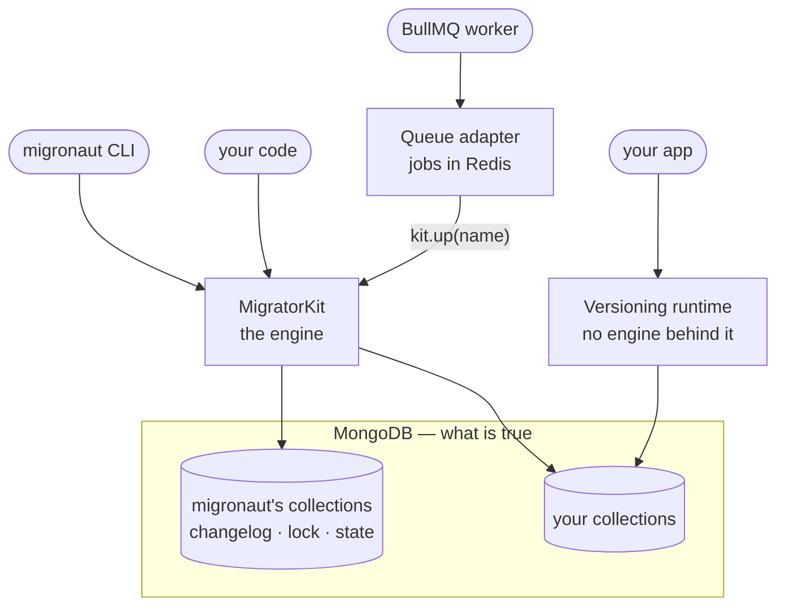
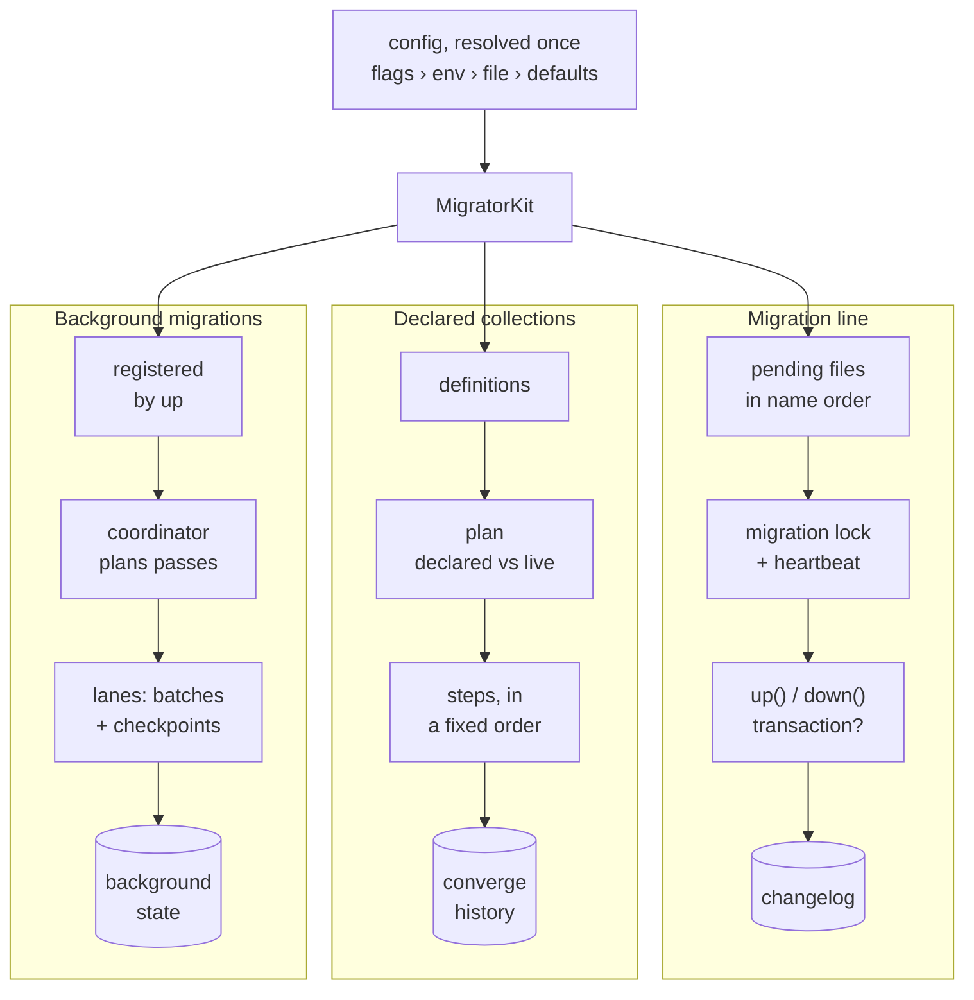
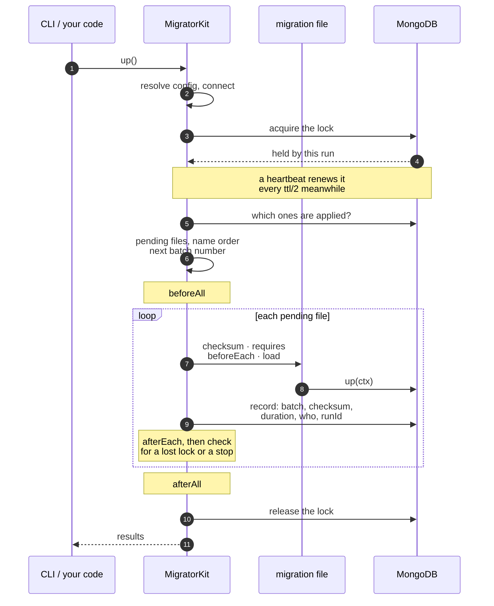
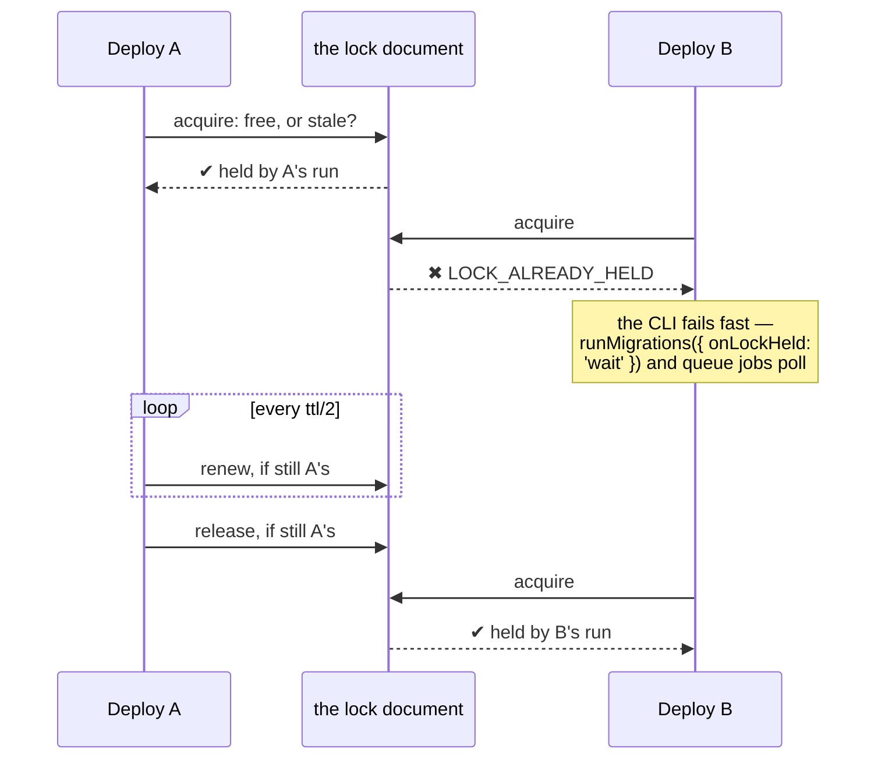
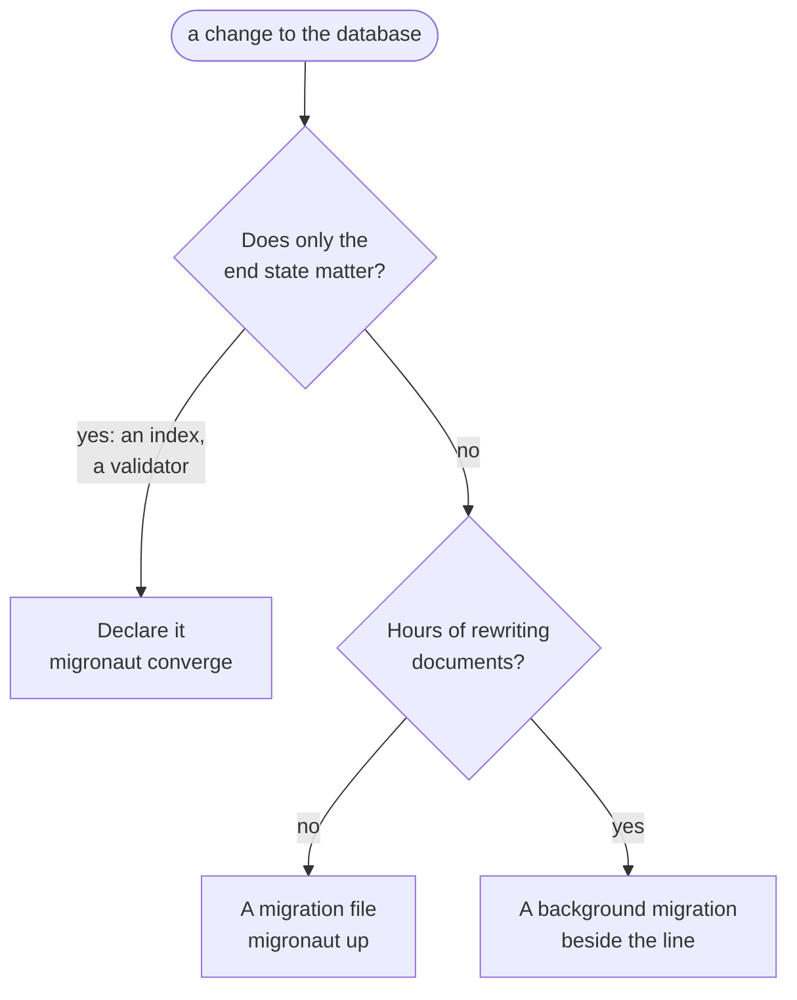
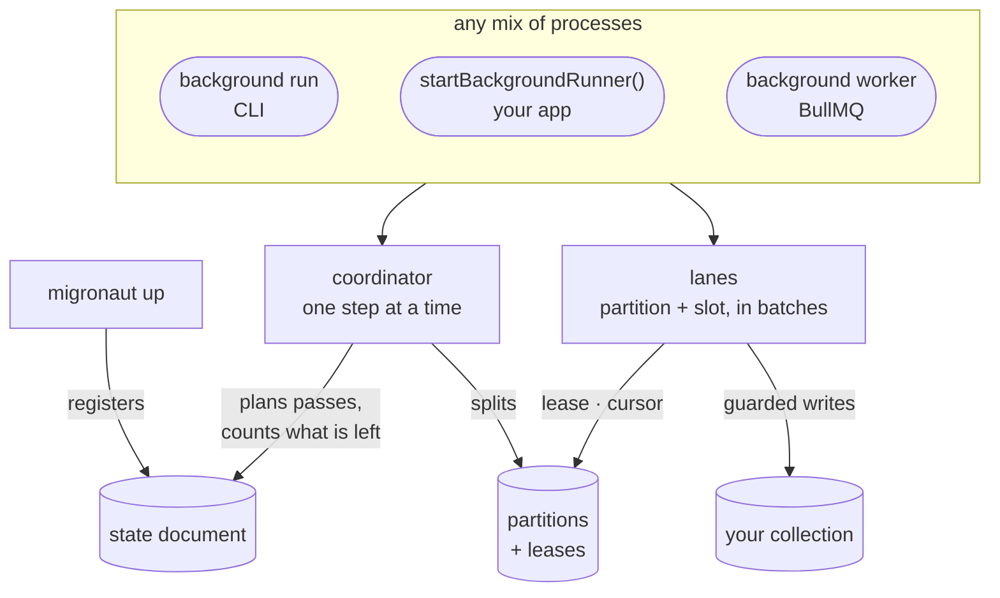
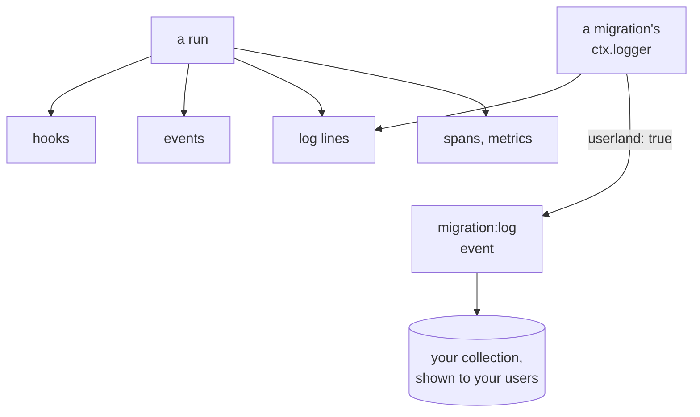

# How It Works

[Core Concepts](/guide/concepts) explains the vocabulary — migrations, the changelog, batches.
This page shows the machine: which parts migronaut is made of, where each one keeps its state, and
what happens, step by step, when they run. Each feature has a page of its own; this one is the map.

## One engine, several doors

- **The engine is one class**, `MigratorKit`. The CLI is a thin wrapper around it, and so is
  [`runMigrations`](/guide/api) — there is no second implementation behind either.
- **The [queue adapter](/guide/bullmq) is a client of the engine**, like your own code: each job
  calls the kit's public API for one migration. Redis only remembers what was *asked*; whether a
  job may run, and whether it already did, is read from MongoDB when it runs.
- **The [versioning runtime](/guide/versioning) has no engine behind it.** It is a handful of
  functions your application calls on its own collections — the same rules for `__v` and `__rev`
  that [background migrations](/guide/background-migrations) write by.
- **Everything that matters is in MongoDB.** Processes, pods and Redis are only executors: lose one
  and the next run picks up from what the database says.

## Inside the engine

The kit resolves its configuration once, then drives three independent flows. Each has its own way
of staying safe when several processes run it at once.

| Flow | Changes | Kept safe by | Kept in |
|---|---|---|---|
| **The migration line** | Anything, once, in order — with a history | The migration lock: one run at a time | `_migronaut_migrations` |
| **Declared collections** | Indexes, search indexes, validators — only their current value | The same lock; a plan refused whole on conflict | Nothing — every run reads the live database ([history](/guide/collections#history) is only a log) |
| **Background migrations** | Every document of a collection, for hours if need be | Leases per partition; a guarded write per document | `_migronaut_background*` |

Around all three sit the cross-cutting parts: [hooks and events](/guide/hooks), the
[logger](/guide/migration-logs) and [telemetry](/guide/opentelemetry) — [below](#what-a-run-tells-you).

## The life of a run

This is `migronaut up` from start to finish. `down` follows the same path, newest first, and `redo`
is a `down` and an `up`.

- **The lock wraps the whole batch**, not each file: one acquire and one release per run.
- **A failure stops the batch.** What was applied before it stays applied (each record is written
  as its migration succeeds); the failing one is not recorded as applied, and a `'failed'` trace
  says it was attempted.
- **A stop is honoured between migrations** — the only safe point, where the previous migration
  has committed and the next has not started. A migration body that is running always finishes.
- **With `useTransaction`, the record commits with the migration**, so the two can never disagree.
  See [Transactions](/guide/transactions).

## The lock

Every run that writes — `up`, `down`, `redo`, `converge`, `baseline`, `import` — takes one lock: a
single document in `_migronaut_locks`. Two deploys starting at once cannot both migrate.

- **Staleness is judged in server time.** A holder that died stops renewing; once its lock is older
  than `lockTTLSeconds` (60 s by default), the next run reclaims it. The server's clock decides, so a
  pod whose clock runs fast cannot steal a healthy lock.
- **A heartbeat keeps a long migration's lock fresh**, so the TTL only decides how fast a crash is
  recovered — not how long a migration may take.
- **A run that loses its lock stops** before its next migration, with `LOCK_LOST`; it never runs on
  alongside the new holder.
- [`migronaut lock`](/commands/lock) shows who holds it, and [`migronaut unlock`](/commands/unlock)
  clears one left by a crash.

Background migrations never take this lock. Their coordinator has a lock of its own per background
migration, and their lanes hold leases on partitions — [below](#background-migrations-beside-the-line).

## Where the state lives

Nothing is kept on disk or in process memory between runs. These collections are the whole state:

| Collection | Holds | Written by | Created |
|---|---|---|---|
| `_migronaut_migrations` | One record per migration: status, batch, checksum, duration, who, run id | The migration line | At connect, with its indexes |
| `_migronaut_locks` | The migration lock — and each background coordinator's and drift watcher's lock | Every locked run | On first use |
| `_migronaut_converge` | One entry per converge that changed something or failed — never read back to decide anything | `converge` | By its first entry |
| `_migronaut_background` | One state document per background migration: status, plan, pass, totals | `up` (registration), coordinators, controls | On first use |
| `_migronaut_background_partitions` | One document per partition: range, cursor, counters, lease | Coordinators and lanes | On first use |
| `_migronaut_background_watch` | The live drift watchers' resume tokens and counters | The live drift watcher | On first use |

Every name is configurable (`migrationsCollection`, `lockCollection`, `convergeLogCollection`,
`backgroundCollection` — the last moves all three background collections), which is how
[seeds](/guide/seeding) keep a history of their own.

## Choosing the tool for a change

Three flows mean three ways to change a database. They answer different questions:

- **[A migration](/guide/writing-migrations)** — anything that must happen once, in order, with a
  record and a way back: a backfill, a rename, a data fix.
- **[A declaration](/guide/collections)** — what has no history worth keeping. `converge` compares
  the declaration with the live database and makes the difference.
- **[A background migration](/guide/background-migrations)** — a rewrite too big for a deploy. `up`
  only registers it; lanes rewrite the documents while the application runs, and a later migration
  can wait for it with `requires`.

## Background migrations, beside the line

A background migration is registered by `up` like any migration — and then the line moves on. The
rewrite itself is carried out by whichever processes run lanes, coordinated entirely through MongoDB:

- **No process is special.** A coordinator step and a lane slice can run anywhere; a lane that
  dies leaves a lease that expires, and the next claim resumes from its last checkpoint.
- **`maxParallel` is a property of the schema**, not of any process: a unique index on the lease
  slots caps the lanes across every pod.
- **Completion is decided by counting** what still has the old shape, never by adding up
  partitions — so a document an old release wrote in the meantime is found by the next pass.

[Background Migrations](/guide/background-migrations) walks through it all.

## What a run tells you

A run reports on four channels, for four different consumers:

| Channel | For | Can fail the run? |
|---|---|---|
| [Hooks](/guide/hooks) | Logic inside the flow — a notification, a guard | Yes: a throwing hook fails it (`HOOK_FAILED`) |
| [Events](/guide/hooks#events) | Metrics, alerts — any number of listeners | No: a throwing or rejecting listener is contained |
| [Log lines](/guide/migration-logs) | Operators — every line carries the run's correlation | No |
| [Spans and metrics](/guide/opentelemetry) | Tracing — the migration's span is the parent of what it does | No: telemetry never breaks a run |

One value joins them all: the **run id**. It is on the lock document, on every changelog record the
run writes, on every event and log line, and on the run's span — so a trace, a log search and the
database can be lined up after the fact.

## Next

- [Core Concepts](/guide/concepts) — the vocabulary, if you skipped it
- [Getting Started](/guide/getting-started) — install and run your first migration
- [Programmatic API](/guide/api) — drive the engine from your own code
