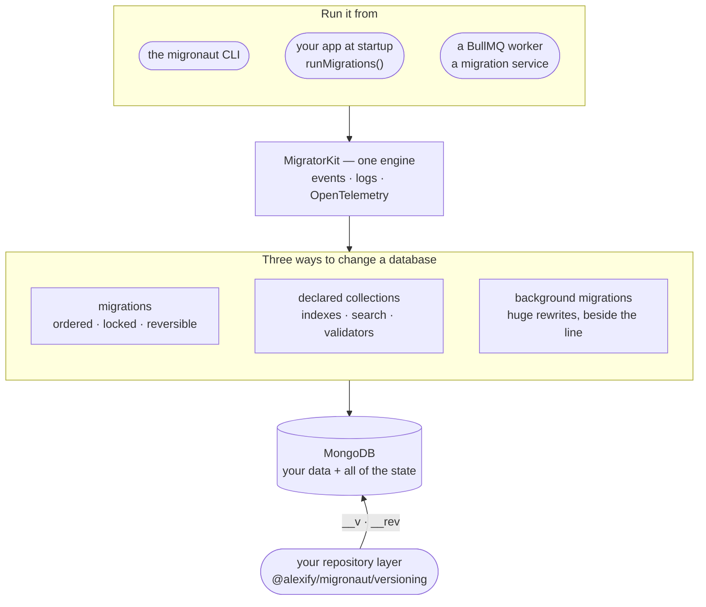

## How it fits together

One engine runs everything — from a terminal, inside your application at startup, or as a queue
worker — and keeps all of its state in MongoDB, next to your data. It changes a database in three
ways, each with its own guarantees.

[How it works, step by step →](/guide/how-it-works)
{.home-section-link}

## Also in the box

- [Opt-in transactions](/guide/transactions) — a migration and its changelog record commit together
- [Lifecycle hooks & events](/guide/hooks) — `beforeAll` … `onError`, and `kit.on(…)` for metrics
- [TypeScript, ESM & CommonJS](/guide/writing-migrations) — `.ts` natively on Node 22.18+
- [Mongoose](/guide/mongoose) — inject your instance, use your models in migrations
- [Seeding](/guide/seeding) — seeds with a history of their own, per environment
- [CI gates & JSON output](/guide/ci-cd) — `status --check`, `converge --check`, `--json`
- [`migronaut audit`](/commands/audit) — a read-only health check of the whole setup
- [Your own id format](/guide/configuration#custom-id-format) — ULID, CUID, UUIDv7 for every id it mints
- [Secrets at runtime](/guide/configuration#async-factory-config-secret-managers) — an async config factory

